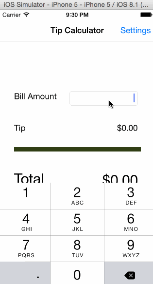

iOS Tip Calculator
================

iOS Tip Calculator for the CodePath prework.

Time Spent: 3 hours

* [x] Required: User can enter bill amount and see tip and total amounts updated instantaneously
* [x] Required: User can select from 3 tip percentages and see tip and total amounts updated instantaneously
* [x] Required: User can navigate to settings page and enter default tip percentage to be persisted between sessions
* [x] Optional: Remember bill amounts across app restarts within 10 minutes of last bill entry

Walkthrough of all user stories:

GIF created with [LiceCap](http://www.cockos.com/licecap/).